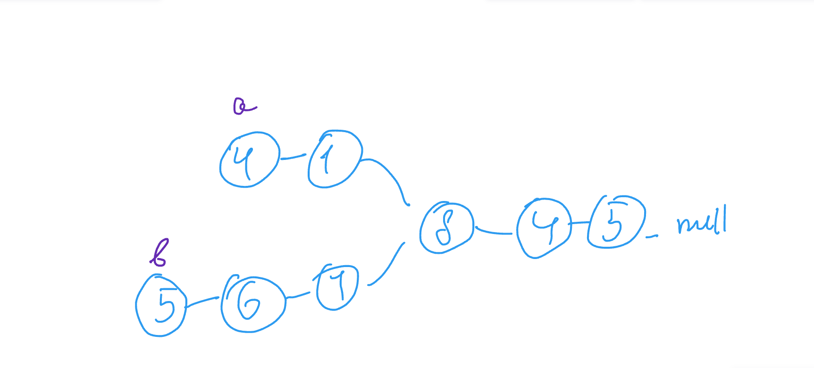
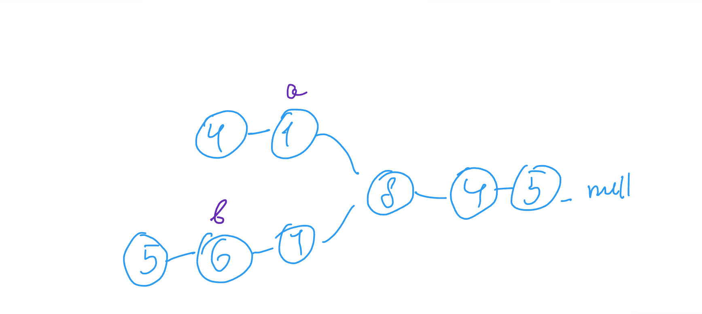
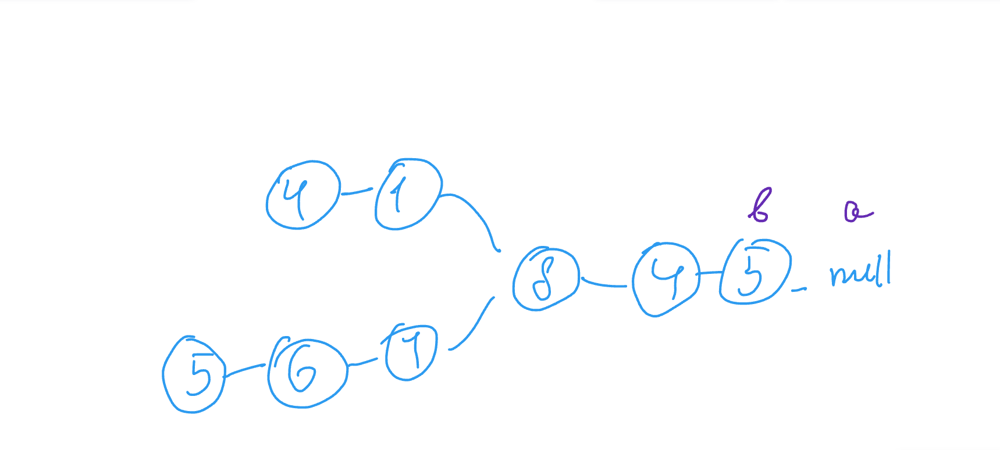
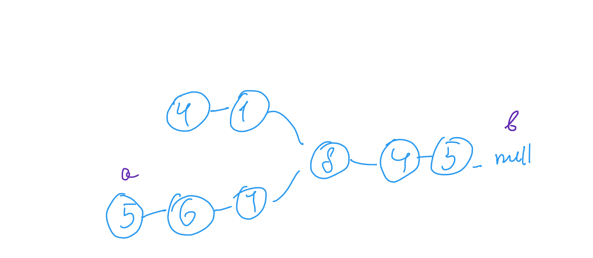
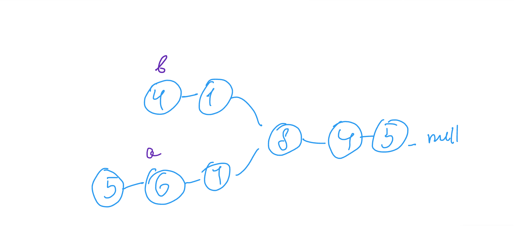
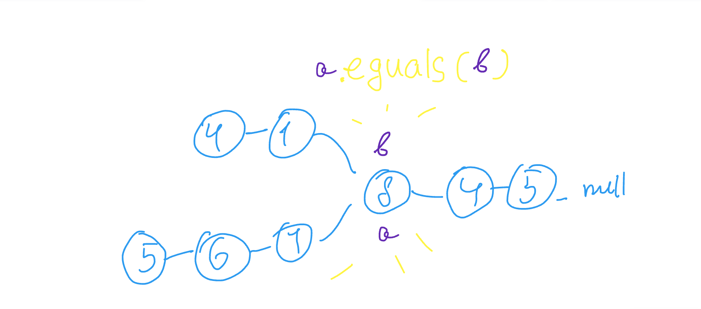

Solution is pretty simple:

    public ListNode getIntersectionNode(ListNode headA, ListNode headB) {
        if(headA == null || headB == null) return null;

        ListNode a = headA;
        ListNode b = headB;

        while(a != b) {

            a = a == null? headB: a.next;
            b = b == null? headA: b.next;
        }
        
        return a;
    }

start:

when null is reached point list to the head of opposite list

    a = a == null? headB: a.next;
    b = b == null? headA: b.next;

and when ListNode object finally equals return any of two 
