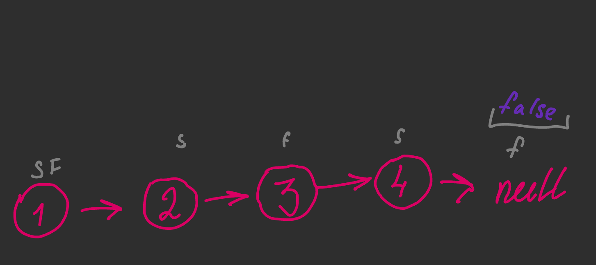
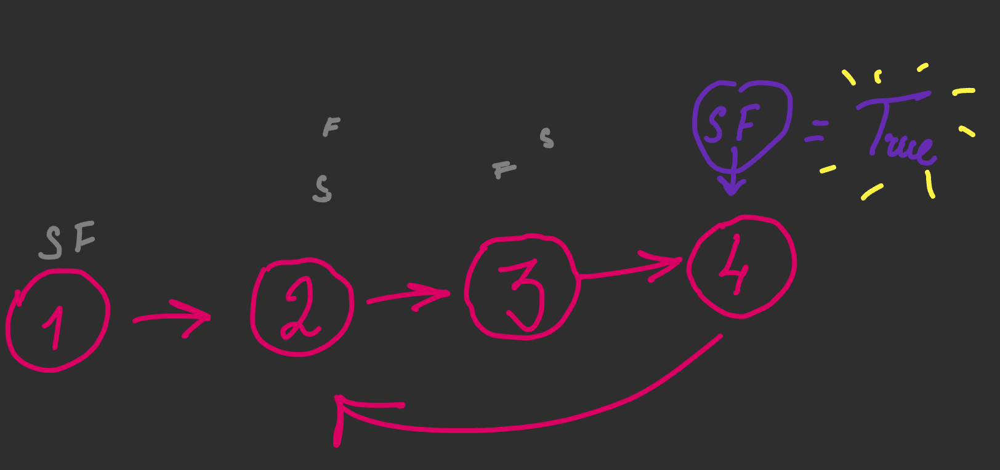

my solution has time complexity O(n) (which is not awesome)

    public static boolean hasCycle(ListNode head) {
        if (head == null) return false;
        Set<Integer> set = new HashSet<>();
        while (head.next != null) {
            if (set.contains(head.hashCode())) return true;
            else {
                set.add(head.hashCode());
                head = head.next;
            }
        }
        return false;
    }

The slower / faster pointer solution :

    public boolean hasCycle(ListNode head) {
        ListNode fast = head;
        ListNode slow = head;

        while (fast != null && fast.next != null) {
            fast = fast.next.next;
            slow = slow.next;

            if (fast == slow) {
                return true;
            }
        }

        return false;        
    }

🪄Explanation🪄

if it is not cycled -> slow pointer will never meet fast pointer 😭

if it is cycled -> slow and faster pointers will meet in one node 💖

