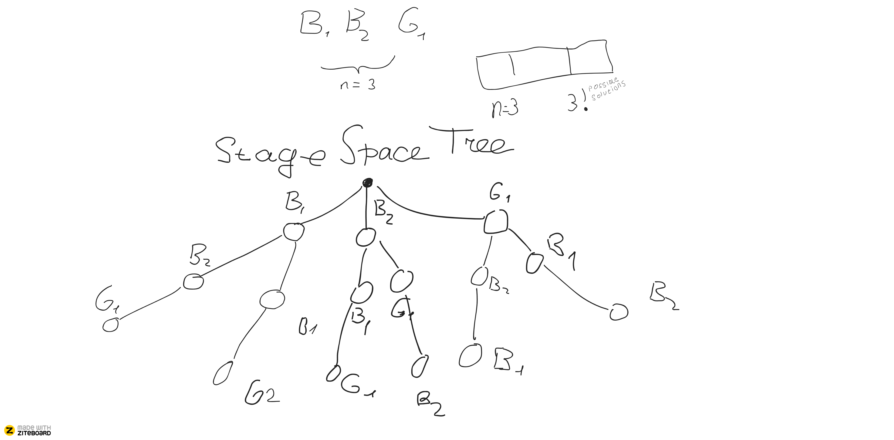

Backtracking is a strategy to find *all possible ways*

each branch of the tree is a possible solution.

CONSTRAINS:

the G1(girl) should not be in the middle

.png)

--------------------
*BFS*

The strategy similar to DFS (Backtracking) is BFS (Branch and Bone)

unlike DFS, BFS is working level-wise
    
LVL1
.png)

LVL2
.png)

LVL3
.png)

